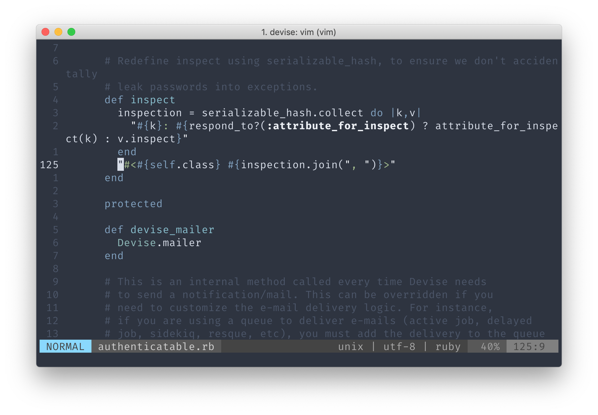
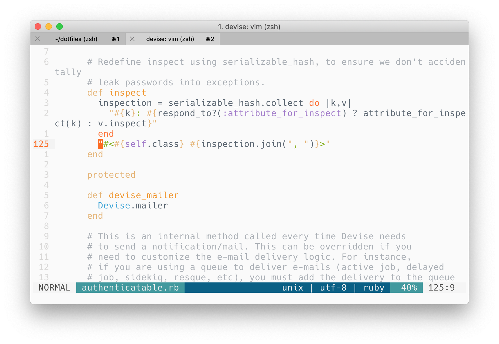
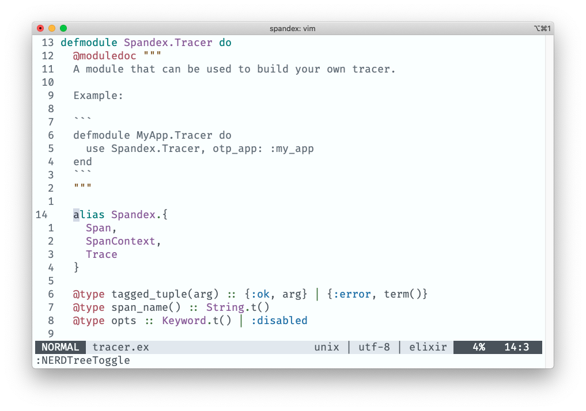

<h1 align="center">
  <br>
  
  <br>
  dotfiles
  <br>
  <br>
</h1>


<h4 align="center">My configuration files for vim, git and ZSH.</h4>

# Install

First, clone this repository:

```bash
cd ~/
git clone git@github.com:tegon/dotfiles.git
```

Then run the setup script:

```bash
cd ~/dotfiles
chmod +x script/setup
script/setup
```

Install the vim plugins:

```bash
vim
:PluginInstall
```

The iTerm2 themes are inside the `themes` folder.

You have to import them `(Preferences -> Profiles -> Colors -> Color Presets... -> Import...)`

And choose the one you want, for example: `(Preferences -> Profiles -> Colors -> Color Presets... -> Nord)`

That's it :)

## Screenshots

### Nord



### Ayu



### Snow


